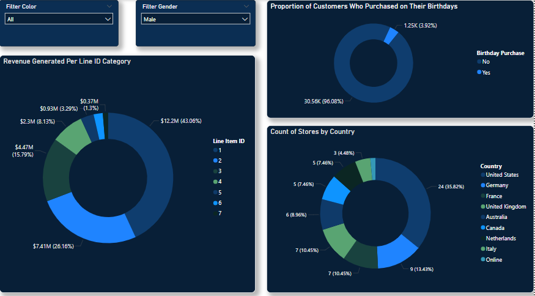

# Power BI Report: Global Retail Electronics Sales

## Overview  
This Power BI report analyzes the Global Electronics Retailer dataset on Maven's Analytics Data Playground, and provides insights on various key areas like:
- Most Popular Brands by Season (Year)
- Probability of sentimental influence in purchase
- Total Revenue, Cost and Net Profit
- Inventory Tracking
- Geospatial Analysis etc

## Features  
- Interactive dashboards  
- Key performance indicators (KPIs)  
- Data filtering options  
- Custom visualizations  

## Data Sources  
- Maven Analytics Data Playground(https://app.mavenanalytics.io/datasets?search=glob)  
- Data cleaned and transformed using Power Query  

## How to Use  
1. Download the `.pbix` file from this repository.  
2. Open it in Power BI Desktop.  
3. Explore the interactive dashboards.  

## Prerequisites  
- Power BI Desktop 

## Screenshots  
  

## Contributing  
Feel free to submit pull requests or open issues for suggestions.  

## License  
This project is licensed under the [MIT License](LICENSE).
